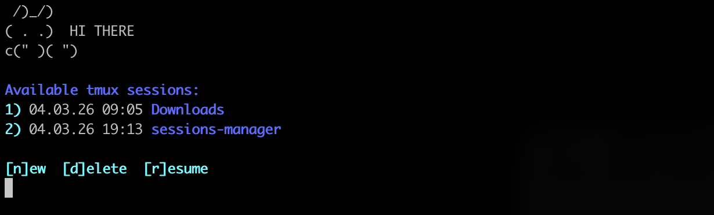

# Session Manager

A lightweight terminal session manager built for macOS, simplifying the management of multiple tmux sessions, especially useful for remote access via OpenSSH.



## Demo


## Features

- **Session Management**: View and manage existing tmux sessions with a simple menu interface.
- **Entry point**: Session manager automatically show the menu every time you open a new terminal.
- **Quick Actions**: Use single-key commands to create, delete, or resume sessions.
- **User-Friendly**: Designed for ease of use, for those unfamiliar with tmux.

## Setup

Run the following command to automatically install and configure the session manager:

```sh
sh -c "$(curl -sL https://raw.githubusercontent.com/Aku-n06/session-manager/main/install.sh)"
```

For more information about setup options, see [SETUP.md](docs/SETUP.md).


## License

This project is licensed under the MIT License. See the [LICENSE](LICENSE) file for details.

## Contributing

Contributions are welcome! Please open an issue or submit a pull request for any improvements or bug fixes.

## Uninstallation

See [UNINSTALL.md](docs/UNINSTALL.md) for detailed uninstallation instructions.

## Support

For questions or issues, please open an issue on the GitHub repository.
